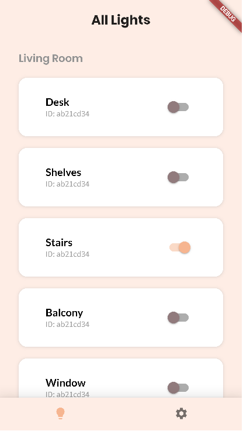
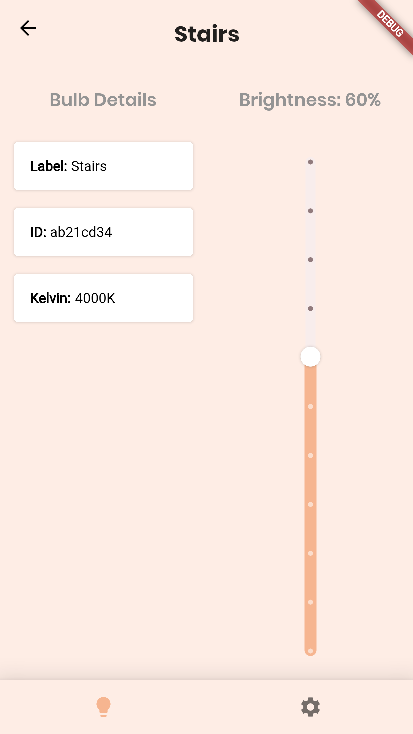

# LIFX Flutter

An app to control your LIFX smart bulbs using the LIFX HTTP API. Built with Flutter.

# Install & Run

## Prerequisites

- [Flutter](https://flutter.dev/)
- An API key from your [LIFX Cloud Account](https://cloud.lifx.com/) 

## Install

- Clone:
  - SSH: `git clone git@github.com:nathanielgreen/lifx_flutter.git`
  - HTTPS: `git clone https://github.com/nathanielgreen/lifx_flutter.git`
- Navigate to directory: `cd lifx_flutter`
- Install dependencies: `flutter pub get`

## Run

The app supports Linux and Web platforms.

- Run
  - Linux: `flutter run -d linux`
  - Chrome: `flutter run -d chrome`

To view the component library run the Storybook with `flutter run lib/storybook.dart`.

# Technologies

**App**

- [Flutter](https://flutter.dev)
- [LIFX HTTP API in Dart](https://pub.dev/documentation/lifx_http_api/) (Author)
- [Beamer (Routing)](https://pub.dev/packages/beamer)
- [Provider (State Management)](https://pub.dev/packages/provider)
- [Shared Preferences (Local storage)](https://pub.dev/packages/shared_preferences)

**Testing**

- [Storybook (Flutter)](https://pub.dev/packages/storybook_flutter)

**Linting and Formatting**

- [dart lint](https://pub.dev/packages/lint)

# System Design

The component structure follows [Atomic Design by Brad
Frost](https://atomicdesign.bradfrost.com/).

The code structure rules follow the
[Effective Dart style guide](https://dart.dev/guides/language/effective-dart/style).

# Screenshots

  
Lights Page
 
  

  
Light Detail Page
 
  

